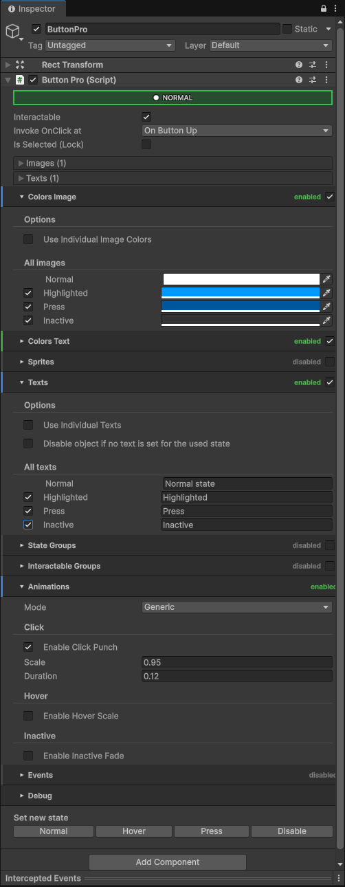
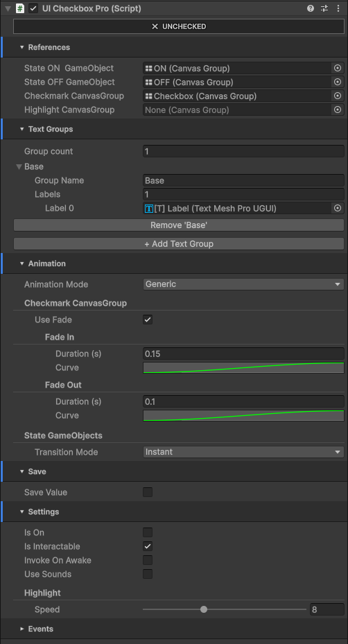
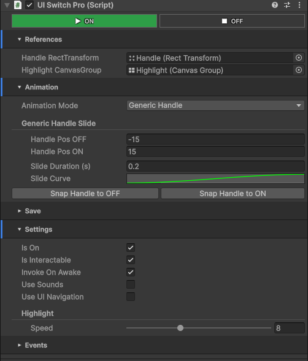
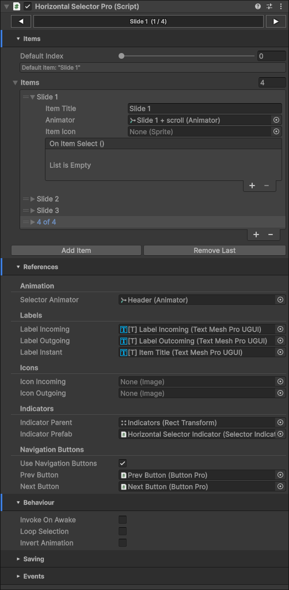
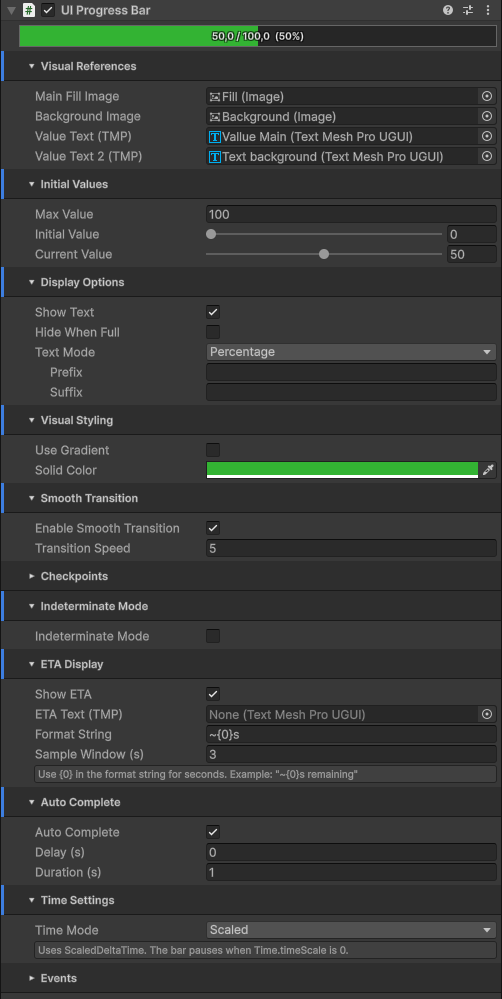
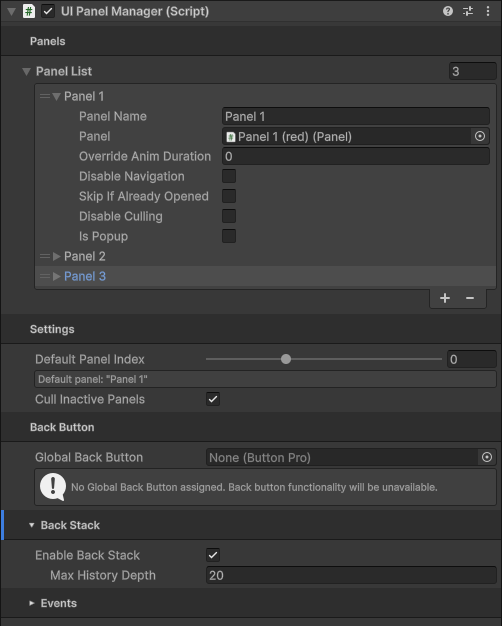
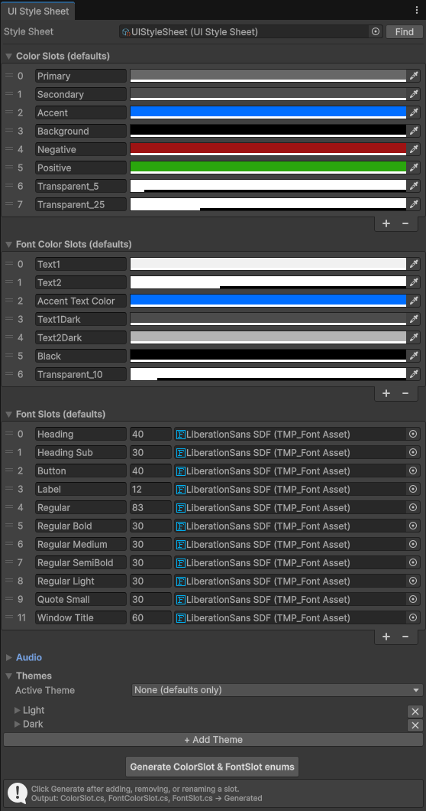

# CorePro UI System

A modular, production-ready UI toolkit for Unity — built as part of a larger internal framework (CorePro).  
This repository contains the UI subsystem: themed components, window management, audio feedback, and editor tooling.

> ⚠️ **All rights reserved.** This repository is public for portfolio purposes only.  
> You may not use, copy, or distribute any part of this code without explicit written permission.

---

## Screenshots

<table>
<tr valign="top">
<td> ButtonPro</td>
<td> CheckboxPro</td>
<td> SwitchPro</td>
</tr>
<tr valign="top">
<td> HorizontalSelectorPro</td>
<td> ProgressBar</td>
<td> UIPanelManager</td>
</tr>
<tr valign="top">
<td> UIStyleSheet (Theme System)</td>
</tr>
</table>

---

## What's inside

### UI Components
Drop-in replacements for Unity's default UI controls, with theming, animation, and sound built in.

| Component | Description |
|---|---|
| `ButtonPro` | Extended button with hover/click states, DOTween animations, sound hooks |
| `CheckboxPro` | Animated checkbox with On/Off states and theme support |
| `SwitchPro` | Toggle switch with handle animation, PlayerPrefs persistence, full debug menu |
| `HorizontalSelectorPro` | Horizontal option selector with animated transitions |
| `ProgressBar` | Animated progress bar with theme support |
| `ImagePro` | Theme-aware image component |
| `ScrollViewPro` | Enhanced scroll view |

### Theme System
ScriptableObject-based theming — define palettes once, apply globally at runtime.
- Multiple themes per project (e.g. Dark / Light / Custom)
- Components subscribe to theme changes automatically
- No code required to switch themes at runtime

### Window Manager
Open, close, and stack UI windows with animated transitions.
- Supports layered window stacks
- Integrates with the theme and audio systems

### Audio System
UI sound feedback without boilerplate.
- `UIAudio` singleton for click and hover sounds
- `AudioLibrary` ScriptableObject — define SFX and Music entries in the Inspector
- **Code generation:** `AudioConstantsGenerator` auto-generates a typed C# constants file  
  (`SFX.Weapons_Pistol_Shoot`, `Music.Combat_MainTheme`) — no more magic strings

### Editor Tooling
- Custom Inspectors for all components
- Context menu debug actions on every component (`Debug / Toggle`, `Debug / Print State`, etc.)
- AudioLibrary editor window with **Regenerate Constants** button

---

## Architecture notes

- **ScriptableObject-driven** — themes, audio libraries, and configuration live in assets, not code
- **DOTween** used for all UI animations
- **`#if UNITY_EDITOR`** guards throughout — zero editor code in builds
- XML doc-comments on all public and internal APIs
- Designed for scalability — each subsystem is independent and can be used without the others

---

## Requirements

- Unity 6+ (LTS recommended)
- DOTween (free or Pro)

---

## Part of CorePro

This repo is a public slice of a larger private framework used across multiple shipped Unity projects.  
Other CorePro modules (gameplay systems, tools, networking helpers) are not included here.

---

*Arkadiusz — [Portfolio](https://arek7r.github.io) · [Asset Store](https://assetstore.unity.com/publishers/109617)*
